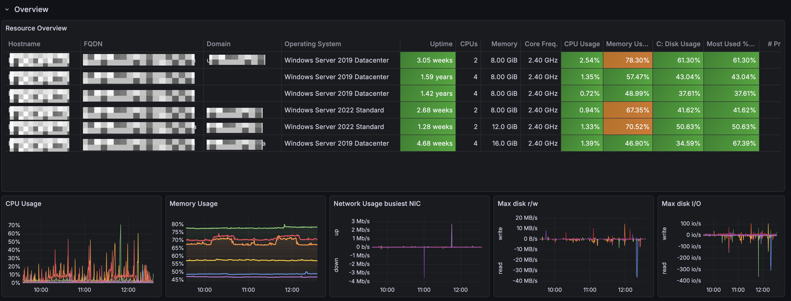
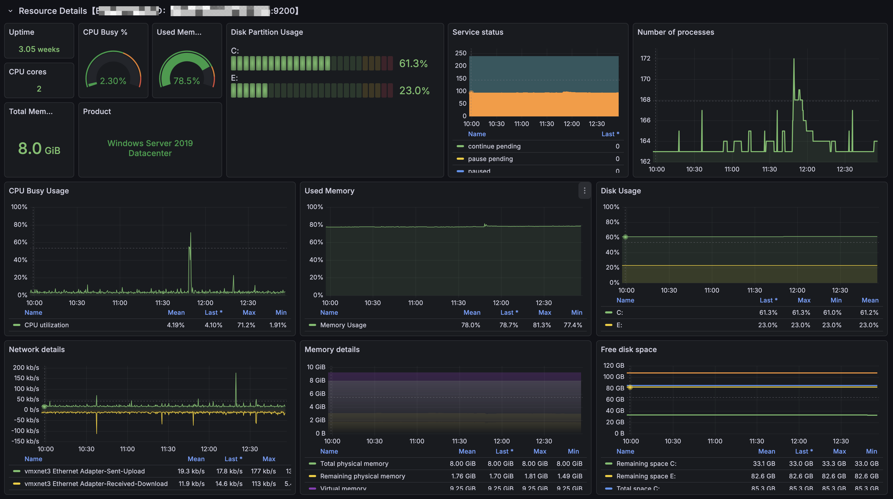
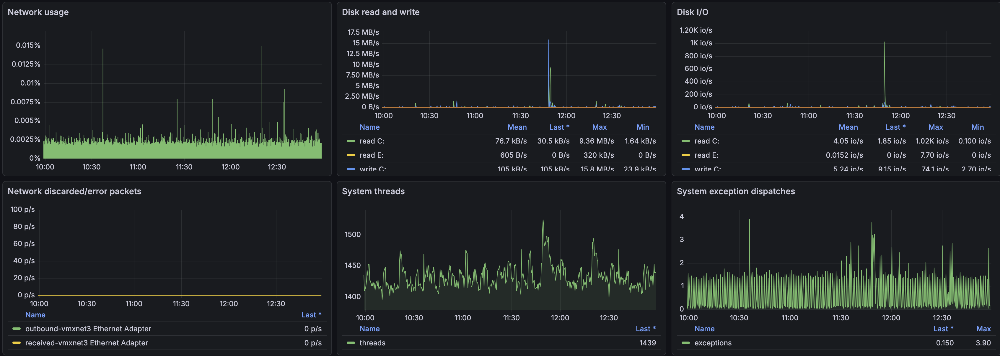

## Sample dashboard for Windows Exporter

This sample dashboard is heavily inspired by [this dashboard in Chinese](https://grafana.com/grafana/dashboards/10467-windows-exporter-for-prometheus-dashboard-cn-v20230531/).

First row shows an Overview of your Windows landscape.
 

Second row provides resource details about specific Windows VM picked from the variables at the top.
 

 

