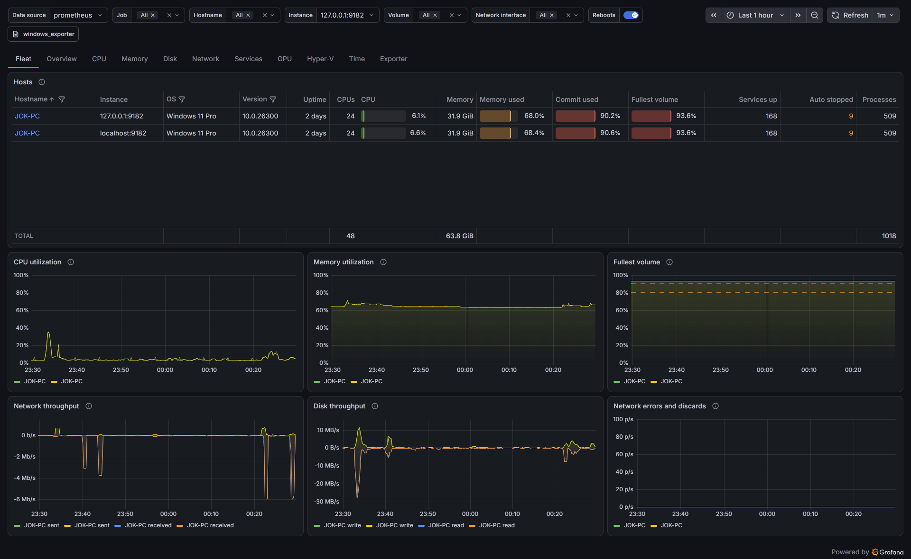
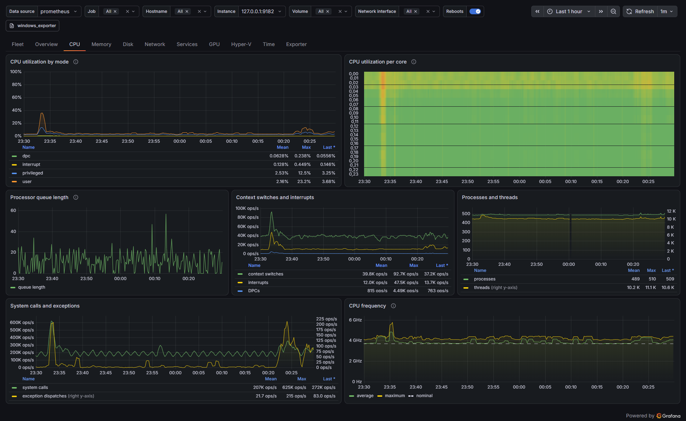
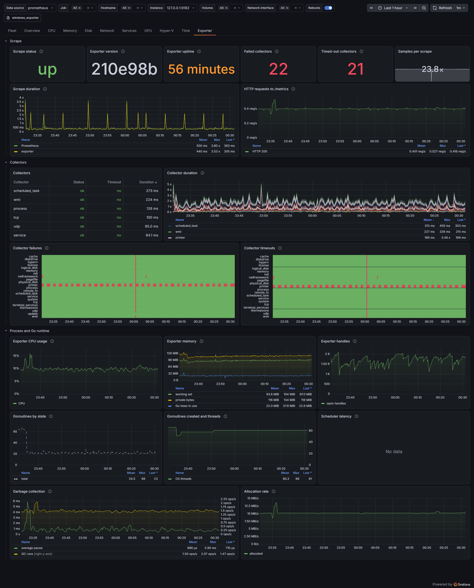

## Sample dashboard for Windows Exporter

[windows-exporter-dashboard.json](windows-exporter-dashboard.json) is a Grafana dashboard for hosts monitored by windows_exporter.
It was originally inspired by [this dashboard in Chinese](https://grafana.com/grafana/dashboards/10467-windows-exporter-for-prometheus-dashboard-cn-v20230531/)
and takes several ideas from Grafana's [windows-observ-lib](https://github.com/grafana/jsonnet-libs/tree/master/windows-observ-lib).

### Requirements

- Grafana 13 or later with a Prometheus data source. The file uses the v2 dashboard schema, which Grafana needs for tabs.
- windows_exporter with the default collectors (`cpu`, `logical_disk`, `memory`, `net`, `os`, `physical_disk`, `service`, `system`).
  The SMB, Processes, Scheduled tasks, Updates, GPU, Hyper-V and Time tabs, the TCP and UDP rows of the Network tab and the Drives and Storage Spaces rows of the Disk tab need the `smb` or `smbclient`, `process`, `scheduled_task`, `update`, `gpu`, `hyperv`, `time`, `tcp`, `udp`, `diskdrive` and `storage_spaces` collectors, which are not enabled by default.
  The sample shows every tab; build the dashboard from the [mixin](../contrib/mixin#collectors) with your collectors to hide the others.
  The process names in the GPU tab need the `process` collector.
  GPU temperature, fan, power and clock panels require WDDM 2.4 or newer and driver support; unsupported sensors are absent.

Import the JSON file through **Dashboards > New > Import** and pick the Prometheus data source in the **Data source** variable.

### Variables

| Variable          | Description                                                                 |
|-------------------|-----------------------------------------------------------------------------|
| Data source       | The Prometheus data source to query.                                        |
| Job               | One or more scrape jobs.                                                    |
| Hostname          | Narrows the fleet overview and the instance list to the selected hostnames. |
| Instance          | The host shown in all tabs except Fleet.                                    |
| Volume            | Volumes shown in the Overview and Disk tabs. `HarddiskVolume*` are hidden.  |
| Network interface | Interfaces shown in the Overview and Network tabs.                          |
| Process           | One or more process names shown in the Processes tab, or All.               |
| Top N processes   | Maximum processes per graph: 5, 10 (default), or 20.                         |

The **Reboots** annotation marks each reboot of the selected host on all graphs.

### Tabs

| Tab      | Content                                                                                                                                                             |
|----------|---------------------------------------------------------------------------------------------------------------------------------------------------------------------|
| Fleet    | Counts of hosts, hosts down and hosts above the CPU, memory and disk alert thresholds or with stopped automatic services; one row per host with OS version, uptime, CPU, memory, commit charge, C: and fullest volume usage and stopped automatic services; graphs of the 25 highest hosts, including the busiest interface per host.        |
| Overview | Summary of the selected host: operating system, uptime, CPUs, memory, commit charge, volumes, disk and network throughput.                                          |
| CPU      | Utilization by mode and per core, processor queue length, context switches, interrupts, processes, threads, system calls and the effective CPU frequency.           |
| Memory   | Used and available physical memory, commit charge, hard page faults, kernel pools and the system cache.                                                             |
| Disk     | Volume label, disk, file system, size and free space, usage, busy time, throughput, IOPS, latency and queue length; drive model, size, partitions and status; busy time, throughput, IOPS, latency, queue length and split I/O per physical disk, labelled with the drive model when `diskdrive` is enabled; health, size and usage of Storage Spaces pools and health, size, pool footprint and efficiency of their virtual disks. |
| Network  | Throughput, utilization, packets, errors and discards per interface; TCP connection states and rates, segments and retransmissions; UDP datagrams and errors.       |
| SMB      | Open files, connections, traffic, requests and opened files per share this host serves; traffic, requests, latency, queue length, credit stalls and metadata requests per remote share this host uses. |
| Services | Running, pending and disabled services, automatic services that are not running, and services that started or stopped in the time range.                            |
| Processes | CPU usage, working set, private bytes, I/O throughput and operations, threads, handles and page faults per process, labelled with name and PID.                  |
| Scheduled tasks | Task count, running, disabled and never-run tasks, enabled tasks with an unknown result code or missed runs, tasks that ran in the time range, and all tasks with state, last result and missed runs. |
| Updates  | Pending updates by severity and category, the oldest pending update, the time since the last Windows Update check, a list of pending updates and the query duration. |
| GPU      | Utilization by engine type, memory capacity, commitment and locality, temperature, fans, power, clocks, and top processes by GPU utilization and memory.                                                                   |
| Hyper-V  | VM count and health, Hyper-V WMI health, host CPU time, CPU and memory per VM, virtual disks, virtual switches and VM network adapters.                             |
| Time     | Time zone, clock sync source, NTP time sources, clock offset and NTP round-trip delay.                                                                              |
| Exporter | Scrape status and duration, exporter version and uptime, collector status, duration, failures and timeouts, and the exporter's CPU, memory, handles and Go runtime. |

Click a hostname in the Fleet tab to open that host in the Overview tab.

Each per-host tab starts with a row of current values, each with a sparkline
of the time range behind it. Green, orange and red show health against fixed
thresholds; values without a meaningful threshold, like throughput or counts,
stay in the text color.

The Processes tab starts with totals for all selected processes: process count,
threads, handles, CPU usage across the host, private working set and private bytes.
The synthetic Idle process (PID 0) is excluded. Each graph shows at most **Top N**
processes, ranked separately at the end of the time range, with a fixed set of
process IDs across the graph. Processes that exited before that point may not
appear. I/O graphs combine read, write and other operations per process.

### Changing the dashboard

Don't edit the JSON file by hand. It is generated from Jsonnet with [grafonnet](https://github.com/grafana/grafonnet) as part of the [windows_exporter mixin](../contrib/mixin):

- [dashboards/windows-exporter.libsonnet](../contrib/mixin/dashboards/windows-exporter.libsonnet) composes the dashboard from one file per tab.
- [dashboards/builders.libsonnet](../contrib/mixin/dashboards/builders.libsonnet) holds the panel, query, and layout builders.
- [dashboards/styles.libsonnet](../contrib/mixin/dashboards/styles.libsonnet) shares the visualization defaults.

The generator writes the v2 schema directly, so it needs neither Grafana nor Prometheus.
Install [mise](https://mise.jdx.dev/) and Go, then install the pinned tools and
regenerate the file in `contrib/mixin` (use WSL on Windows):

```sh
cd contrib/mixin
mise trust
mise install
mise run dashboard
```

`mise run dashboard` runs `jb install` to fetch grafonnet into `contrib/mixin/vendor` and renders the dashboard.
`mise run lint` fails if the committed JSON file differs from the generated one.
`mise run check-dashboards` rebuilds it and runs `git diff --exit-code`, as CI does before the mixin tests.
Check new or changed queries in Grafana before you open a pull request, for example by importing the file into a local Grafana 13.







