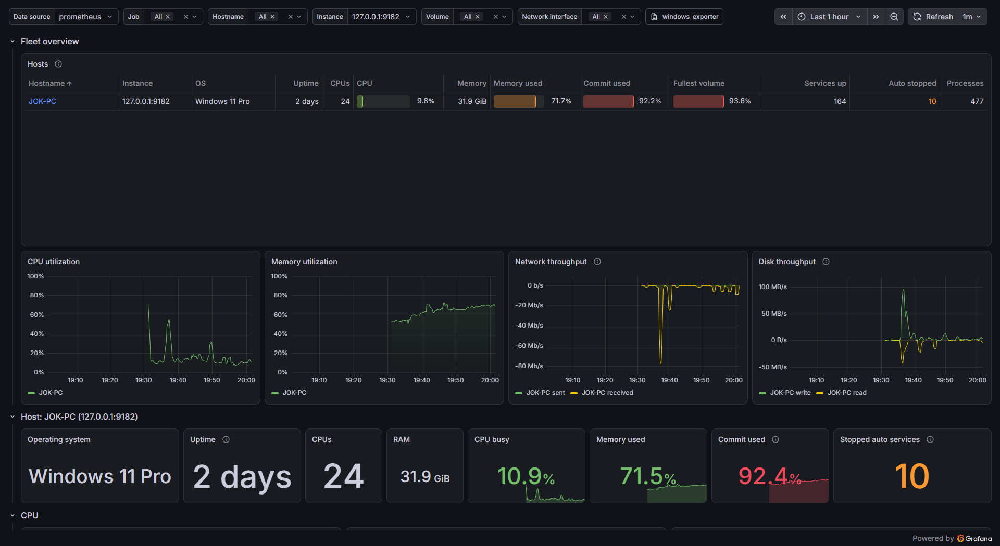
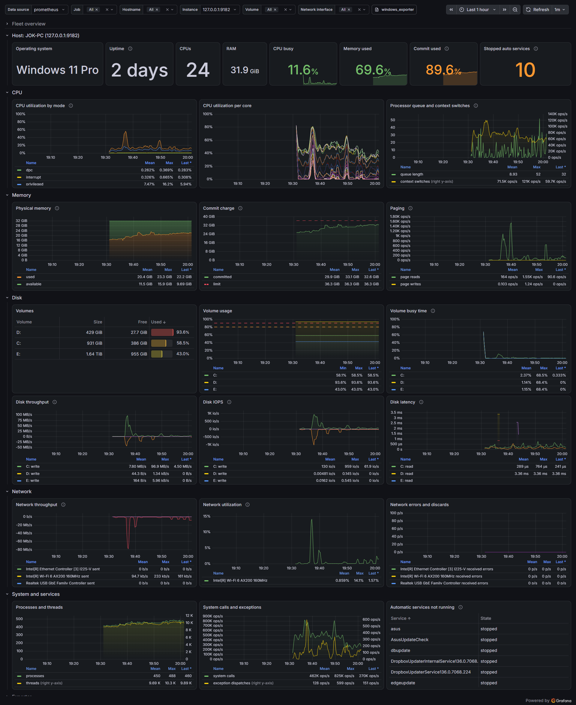

## Sample dashboard for Windows Exporter

[windows-exporter-dashboard.json](windows-exporter-dashboard.json) is a Grafana dashboard for hosts monitored by windows_exporter.
It was originally inspired by [this dashboard in Chinese](https://grafana.com/grafana/dashboards/10467-windows-exporter-for-prometheus-dashboard-cn-v20230531/).

### Requirements

- Grafana 11 or later with a Prometheus data source.
- windows_exporter with the default collectors (`cpu`, `logical_disk`, `memory`, `net`, `os`, `physical_disk`, `service`, `system`).
  Every panel uses metrics from these collectors only.

Import the JSON file through **Dashboards > New > Import** and pick the Prometheus data source in the **Data source** variable.

### Variables

| Variable          | Description                                                                         |
|-------------------|-------------------------------------------------------------------------------------|
| Data source       | The Prometheus data source to query.                                                |
| Job               | One or more scrape jobs.                                                            |
| Hostname          | Narrows the fleet overview and the instance list to the selected hostnames.         |
| Instance          | The host shown in the detail rows.                                                  |
| Volume            | Volumes shown in the disk row. `HarddiskVolume*` volumes are hidden.                |
| Network interface | Interfaces shown in the network row.                                                |

### Fleet overview

The collapsed **Fleet overview** row lists every host with uptime, CPU, memory, commit charge, the fullest volume and stopped automatic services.
Click a hostname to show that host in the detail rows below.

### Host details

The detail rows show the selected instance:

- **Summary**: operating system, uptime, logical processors, installed memory, CPU busy, memory used, commit charge and stopped automatic services.
- **CPU**: utilization by mode and per core, processor queue length and context switches.
- **Memory**: used and available physical memory, commit charge against the commit limit, and hard page faults.
- **Disk**: volume size and free space, usage over time, busy time, throughput, IOPS and average latency.
- **Network**: throughput, utilization against the link speed, and errors and discards per interface.
- **System and services**: processes and threads, system calls and exceptions, and automatic services that are not running.
- **Exporter** (collapsed): status and duration of each collector.

